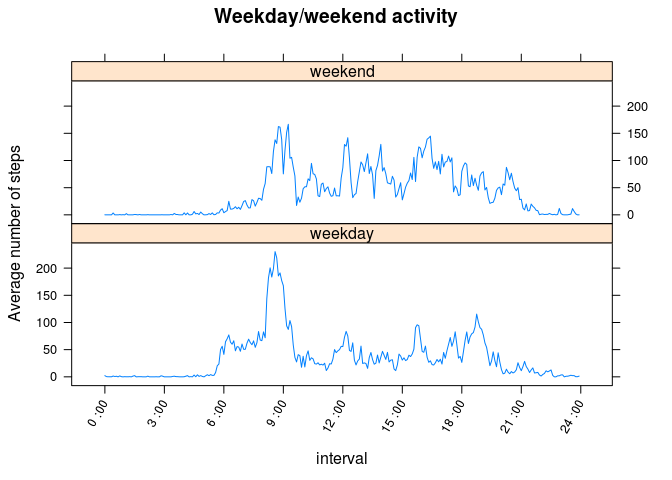

# Reproducible Research: Peer Assessment 1


## Loading and preprocessing the data
First we unzip the dataset file and read the csv.

```r
unzip("activity.zip")
raw_data <- read.csv("activity.csv", colClasses=c("numeric", "Date", "numeric"))
```
We then turn the interval value into the number of minutes since midnight to the start of the interval.

```r
data <- transform(raw_data, interval_num= interval %/% 100 * 60 
                  + interval %% 100) 
data <- transform(data, interval = paste(sprintf("%02d", interval %/% 100), ":", sprintf("%02d", interval %% 100)))
data$interval <- factor(data$interval)
```

## What is mean total number of steps taken per day?

Histogram of the total number of steps taken each day:

```r
daily_steps <- tapply(data$steps[!is.na(data$steps)], data$date[!is.na(data$steps)], sum)
hist(daily_steps, xlab="Total number of steps in a day", 
     main="Histogram of the total number of steps taken each day")
```

 


Mean:

```r
mean(daily_steps)
```

```
## [1] 10766
```


Median:

```r
median(daily_steps)
```

```
## [1] 10765
```


## What is the average daily activity pattern?


```r
avg <- tapply(data$steps[!is.na(data$steps)], data$interval_num[!is.na(data$steps)], mean)
plot(names(avg), avg, type = "l", xaxt="n", ylab="Average number of steps", xlab="Time", 
     main="Time series plot of the average number of steps taken, averaged across all days")
axis(1, at=180 * (0:8), labels = paste(3 * 0:8, ":00"), las=2)
```

 

Interval containing the maximum number of steps:

```r
interval_num_max <- names(which.max(avg))
data$interval[data$interval_num == 515][1]
```

```
## [1] 08 : 35
## 288 Levels: 00 : 00 00 : 05 00 : 10 00 : 15 00 : 20 00 : 25 ... 23 : 55
```

## Imputing missing values
Number of missing values:

```r
sum(is.na(data$steps))
```

```
## [1] 2304
```

Here we replace the missing value by the average of the corresponding interval:

```r
data_filled <- data
data_filled$steps[is.na(data$steps)] <- avg[as.character(data$interval_num[is.na(data$steps)])]
```

Recalculation of the histogram of the daily totals, mean and median after filling in the missing values:

```r
daily_steps_filled <- tapply(data_filled$steps, data_filled$date, sum)
hist(daily_steps_filled)
```

 

```r
mean(daily_steps_filled)
```

```
## [1] 10766
```

```r
median(daily_steps_filled)
```

```
## [1] 10766
```


Impact on the mean and median is minimal, except that 8 days have been added to the middle bin (all the values for those days were missing, so they previously weren't counted at all, and they've been added as completely average days).
Missing days:

```r
setdiff(names(daily_steps_filled), names(daily_steps))
```

```
## [1] "2012-10-01" "2012-10-08" "2012-11-01" "2012-11-04" "2012-11-09"
## [6] "2012-11-10" "2012-11-14" "2012-11-30"
```

## Are there differences in activity patterns between weekdays and weekends?


```r
f <- function(x) {
  if(tolower(weekdays(x)) %in% c("saturday", "sunday", "samedi", "dimanche")) 
    "weekend" 
  else 
    "weekday"
  }
data_filled <- within(data_filled, w <- lapply(date, f))
data_filled$w <- factor(unlist(data_filled$w))
library(lattice)
avg <- aggregate(steps ~ interval_num * w, data_filled, mean)
xyplot(steps ~ interval_num | w, avg, type="l", scales=list(x=list(at=seq(0, 1440, 180),
       labels=paste(3 * 0:8, ":00"), rot=60)), 
       xlab="interval", ylab="Average number of steps", 
       main="Weekday/weekend activity", layout=c(1,2))
```

 
